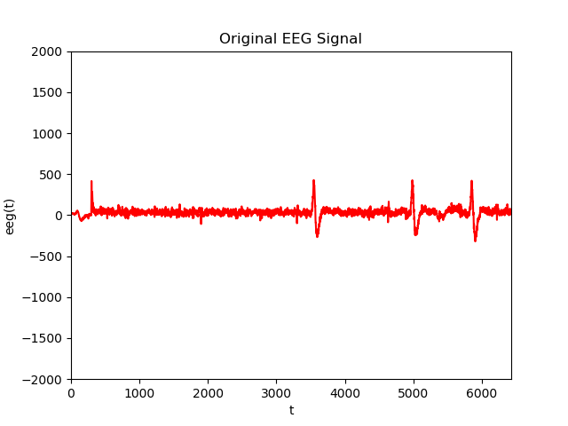
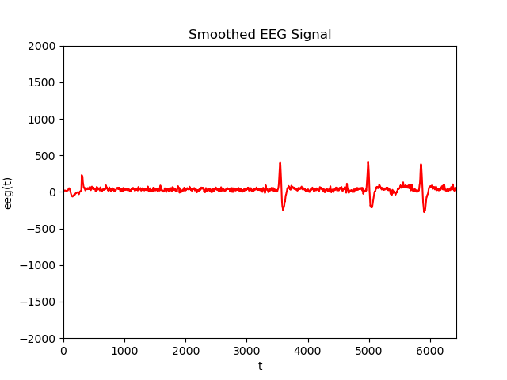

<p align="center">
    
    
</p>


<p align="center">
    
</p>


# 📟  Python Scientific 

Nowadays, python is ruling the world.  This very humble language that was once the realm of enlighted developers that loved to create the most beautiful scripting language is now becoming the programming language of the world, and particularly of the data deluge.

This repository allows you to install all the necesary stuff to start working with python on scientific applications, and particularly, to work with sensor data and neuroscience time-series.  It allows you to install everything you need and start coding with NumPy, SciPy, OpenAI and MNE.

If you don't know anything at all about python, and you want to know something that will help you to do what you need, this is one place to be.

## Contents

* 🔪 Python Introduction
* 📥 Workspace Setup
* 📈 Signal Processing Overview
* 🔎 Signal Analysis and Feature Extraction
* 🛠 Python ML/DL Tools and Techniques
* 🧠 Neurodata Processing


## Procedure for Windows

 * Install Python for Windows https://www.python.org/downloads/windows/

 Write down the location where you install python and add it to the PATH environment variable.

 * Install Git Bash

   https://git-scm.com/downloads 
 
 * Install Visual Studio Code
 
  Download and install it from https://code.visualstudio.com/download
  
 * Clone this repository
 
  From the Git Bash console, run
  
 ```bash
 git clone https://github.com/faturita/python-scientific.git
 ```
 
 * Run a Git Bash Prompt or Terminal
 * Move with "cd" to the directory that you just downloaded ("cd python-scientific")

### Create the virtual environment

Up to date, the scripts are compatible with python 3.11.4.  So you need to download this python version and install it somewhere.

Then, you need to create a virtual envirnonment

 ```bash
 python -m venv ps
 ```

This will create the directory ''ps'' on current directory.  And then, activate the directory

 ```bash
 source ps/bin/activate
 ```

(or run **.\ps\Scripts\Activate on windows)

Finally you can install all the minimal requirements for this python version:

 ```bash
 pip install -r config/requirements.txt
 ```

<details>
<summary>🗄 What's on each file</summary>

* [helloworld.py](helloworld.py): Basic Python Data Science sample.  Grab a dataset and visualize it.
* [helloworldnotebook.ipynb](helloworldnotebook.ipynb): The same, as jupyter notebook.
* [onepasspython.py](onepasspython.py): Basic python 3.x structures, sentences and control keywords.
* [diveintopython3.py](diveintopython3.py): Some python stuff particular to python 3.
* [numpies.py](tensors.py): Basic cookbook on how to deal with numpy tensors.
* [darawrangling.py](datawrangling.py): Basic cookbook for data wrangling in Pandas.
* [downloadandcheck.py](downloadandcheck.py): Basic sample to get an online dataset and plot it.
* [scientificnotation.py](scientificnotation.py): Some numerical stuff for python.
* [filter_temporal.py](filtrostemporales.py): Convolution and numpy slicing.
* [filter_spectral.py](filtrosespectrales.py): Basic sample to extract spectral characteristics from time series.
* [filter_spatial.py](filtrosespaciales.py): Blind source separation sample.
* [onepassfeatureextraction.py](onepassfeatureextraction.py): Program to extract features from an image using opencv.
* [onepassclassifier.py](onepassclassifier.py): Program to classify those features using different classifiers.  This contains all the elements to implement a classification model.
* [InteractiveNotebook.ipynb](InteractiveNotebook.ipynb): Jupyter notebook sample for creating visualizing tools with Altair.
* [baseline.py](baseline.py): Signal baseline removal sample.
* [signalfeatures.py](signalfeatures.py): Basic set of feature extraction procedures for signals (time series).
* [thresholding.py](thresholding.py): Otsu method to umbralize a one dimensional time series.
* [eventcounter.py](eventcounter.py): Signal peak counting sample.
* [clustering.py](clustering.py): Clustering sample containing kmeans and dbscan.
* [tsneclustering.py](ejemploclusteringtsne.py): tSNE dimensionality reduction sample on MNIST.
* [umapclustering.py](ejemploclusteringumap.py): UMAP dimensionality reduction sample on MNIST.
* [signalfeatureclassification.py](signalfeatureclassification.py): Runs on environmentann3w.yml environment. Process an EEG signal and detects alpha suppression with eyes closed.  Classify them using Keras.
* [qlearning.py](qlearning.py): Basic OpenAI Gym sample for QLearning.
* [taxilearning.py](taxilearning.py): This is a basic Gym scenario to verify RL optimization.
* [choppersample.py](choppersample.py): A basic game that can be used to test different AI strategies to solve.
* [easygame.py](easygame.py): Pygame engine that can be used as a template.
* [transformers.py](transformers.py): Program to processes EEG data and trains a Transformer model to classify different mental states or activities.

</details>

# How to update your own repository with new changes from the server repository ?
  
  Run gitbash (windows) or start a new Console on Mac or Linux.

  First you need to upload your own changes to your OWN repository.
  
  ```bash
  git commit -m"Just write down whatever comes to your mind here" .
  ```
  
  After that you need to PULL fresh changes from the server repository at github.
  
  ```bash
  git pull origin master
  ```
  
  If you have happened to modify a file, the previous command will trigger an automatic merge.  If the merge is successful it will open a VI console (just press ':' and 'x') to add a merging comment.
  If there is any conflict, check the modified files looking for any sign of conflict (you will clearly notice it).  After you fix the merging, mark it as resolved with 'git add filename' and finish the operation with 'git commit -m"Merge fixed"'

## How to update your own repository (if it is forked) with new changes from the original repository

First, in the upper right corner of the [repository page](https://github.com/faturita/python-scientific), click on the "Fork" button. This will create a copy of the repository in your own github account. Then, go to your github profile, find the forked repository, and clone it to your local machine:

```bash
git clone https://github.com/your-username/python-scientific.git
```

**Optional:** Add your files and changes to your own repository:

```bash
git add .
git commit -m "Just write down whatever comes to your mind here"
git push origin master
```

Add a reference to the original repository, so you can sync changes in the future. This is known as adding an `upstream remote`:

```bash
git remote add upstream https://github.com/faturita/python-scientific.git
```

Fetch the latest changes from the original repository and merge them into your local master branch:

```bash
git fetch upstream
git merge upstream/master
```

Finally, after merging the changes, you can update your forked repository on github to reflect the local changes:

```bash
git push origin master
```

# Python Roadmap

Probably, there are TONS of online resource to learn python.  Those listed here are focused on '''Crash Courses''' that are handy for dealing with scientific data, time series, and some data science applications.

* You can follow this guide: https://www.youtube.com/playlist?list=PLJHMIS4ekxNQ5twHXAFlqYbYg564a-QP9
* Really good online course: https://online-learning.harvard.edu/course/using-python-research
* [Good book in Spanish](docs/IntroPython3.pdf)
* [Python Books Roadmap](docs/Python.md)
* [Basic Algorithms](https://github.com/TheAlgorithms/Python)
* Quick Python Algorithm Snippets https://github.com/bhavinjawade/Advanced-Data-Structures-with-Python
* Very handy and pragmatic coding guidelines: https://guicommits.com/organize-python-code-like-a-pro/
* Join this channel for Q&A: https://itba-ecd-python.slack.com
* Python College Algebra - https://www.youtube.com/watch?v=i7vOAcUo5iA

# Something else about Git

* [Learn Git Branching](https://learngitbranching.js.org/)
* [Atlassian Git Manual](https://atlassian.com/git)

# Documentation
* Roadmap for going deeper into [ML](docs/MachineLearning.md)
* [Learning Python](docs/Python.md)
* [Signal Processing](docs/Signals.md)
* [Aprendizaje Modo Maquina](https://faturita.github.io/posts/2024/01/modomaquina/)


# Awesome Lists
* Awesome list of Python: https://github.com/vinta/awesome-python
* Awesome list of Computer Vision https://github.com/jbhuang0604/awesome-computer-vision

# Some cheatsheets
* https://github.com/afshinea/stanford-cs-229-machine-learning


# Excellent Online Courses
* Extra courses https://github.com/dair-ai/ML-Course-Notes
* Do you want to reinforce your mathematics background? (https://twitter.com/akshay_pachaar)
* StatQuest: https://statquest.org/video-index/
* Khan Academy, Statistics and Probability (by Khan itself): https://www.khanacademy.org/math/statistics-probability
* Excellent MIT Mathematics for Machine Learning https://www.youtube.com/playlist?list=PLUl4u3cNGP62uI_DWNdWoIMsgPcLGOx-V
* Linear Algebra, OCW: https://ocw.mit.edu/courses/18-06-linear-algebra-spring-2010/
* Mathematics for ML Specialization on Coursera https://www.coursera.org/specializations/mathematics-machine-learning
* NLP https://www.youtube.com/playlist?list=PL8PYTP1V4I8D0UkqW2fEhgLrnlDW9QK7z

# Datasets

* https://github.com/awesomedata/awesome-public-datasets
* http://bnci-horizon-2020.eu/database/data-sets

# More info

* What are tensors?: https://arxiv.org/abs/2106.08090

# References and sources

* Visualizations: https://github.com/rougier/scientific-visualization-book
* Bias on DataScience: https://github.com/koaning/scikit-lego, https://github.com/fairlearn/fairlearn
* https://github.com/ml-tooling/best-of-ml-python Best of Machine Learning resources for Python.
* [MacBook configuration to use GPUs](https://towardsdatascience.com/deep-learning-using-gpu-on-your-macbook-c9becba7c43)
* https://code.visualstudio.com/docs/python/python-tutorial Visual Studio Code tips (debugging line by line included)
* https://github.com/spyder-ide/spyder/wiki/Working-with-packages-and-environments-in-Spyder
* https://jalammar.github.io/visual-numpy/
* [Guía Guit](https://rogerdudler.github.io/git-guide/index.es.html)
* [Tom O'Haver Pragmatic Introduction to Signal Processing](https://terpconnect.umd.edu/~toh/spectrum/): Awesome guide on tools to tackle signal processing.
* Imbalanced Datasets: https://machinelearningmastery.com/tactics-to-combat-imbalanced-classes-in-your-machine-learning-dataset/ and https://link.springer.com/article/10.1186/s40537-018-0151-6
* [Gaussian Processes](https://yugeten.github.io/posts/2019/09/GP/): A tutorial on Gaussian Processes.
* https://towardsdatascience.com/t-sne-python-example-1ded9953f26
* https://github.com/lmcinnes/umap
* https://towardsdatascience.com/t-sne-python-example-1ded9953f26
* https://github.com/aaizemberg/: Everything you would like to know about Visualizations, GIS, databases, and big data science.
* https://github.com/ezequielma20/data-science: Excellent resource of this great Data Science Dev from Baufest.
* https://github.com/jbruestle/plaidvision PlaidML Great Sample
* https://blog.goodaudience.com/introduction-to-1d-convolutional-neural-networks-in-keras-for-time-sequences-3a7ff801a2cf
* https://medium.com/odscjournal/data-scientists-versus-statisticians-8ea146b7a47f
* https://github.com/healthDataScience/deep-learning-HAR
* https://towardsdatascience.com/four-ways-to-quantify-synchrony-between-time-series-data-b99136c4a9c9
* https://www.freecodecamp.org/news/how-to-build-your-first-neural-network-to-predict-house-prices-with-keras-f8db83049159/
* https://towardsdatascience.com/dcgans-deep-convolutional-generative-adversarial-networks-c7f392c2c8f8
* https://medium.com/@ODSC/logistic-regression-with-python-ede39f8573c7
* [Python Data Structures](https://github.com/bhavinjawade/)Advanced-Data-Structures-with-Python
* [Cross Entropy](https://towardsdatascience.com/understanding-binary-cross-entropy-log-loss-a-visual-explanation-a3ac6025181a)
* [Visual Information Theory](http://colah.github.io/posts/2015-09-Visual-Information/)
* [History of Artificial Intelligence](https://philippschmitt.com/blueprints-for-intelligence/)
* https://centre-borelli.github.io/ruptures-docs/


