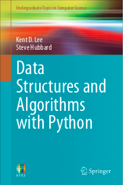
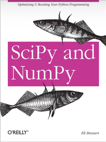
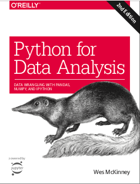

# Books

 # The best python books to undesrtand the language
 <table><td></td><td>
A Primer on Scientifical Programming with python, Langtangen
</td></table>
 <table><td></td><td>
Python for Data Science, for dummies
</td></table>
 <table><td></td><td>
Data Structures and Algorithms with python
</td></table>
 <table><td></td><td>
Fluent Python 3
</td></table>
 <table><td></td><td>
Guide to Numpy
</td></table>
 <table><td></td><td>
Scipy and Numpie
</td></table>
 <table><td></td><td>
Python for Data Analysis, Wes Mckinney
</td></table>
