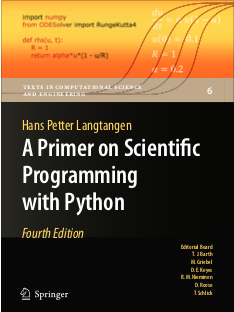
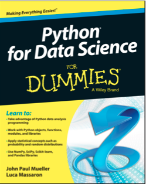
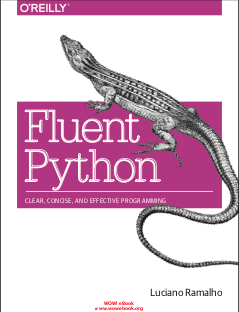

# Books

 # The best python books to undesrtand the language
 <table>
 <tr><td></td><td>
A Primer on Scientifical Programming with python, Langtangen
</td><td>Intro to python from a scientific programming perspective: dealing with numerical errors, code optimization, performance, algorithm convergence.</td></tr>
 <tr><td></td><td>
Python for Data Science, for dummies
</td><td>Intro to python from a scientific programming perspective: dealing with numerical errors, code optimization, performance, algorithm convergence.</td></tr>
 <tr><td></td><td>
Data Structures and Algorithms with python
</td><td>Intro to python from a scientific programming perspective: dealing with numerical errors, code optimization, performance, algorithm convergence.</td></tr>
 <tr><td></td><td>
Fluent Python 3
</td><td>Intro to python from a scientific programming perspective: dealing with numerical errors, code optimization, performance, algorithm convergence.</td></tr>
 <tr><td></td><td>
Guide to Numpy
</td><td>Intro to python from a scientific programming perspective: dealing with numerical errors, code optimization, performance, algorithm convergence.</td></tr>
 <tr><td></td><td>
Scipy and Numpie
</td><td>Intro to python from a scientific programming perspective: dealing with numerical errors, code optimization, performance, algorithm convergence.</td></tr>
 <tr><td></td><td>
Python for Data Analysis, Wes Mckinney
</td><td>Intro to python from a scientific programming perspective: dealing with numerical errors, code optimization, performance, algorithm convergence.</td></tr>
 </table>
